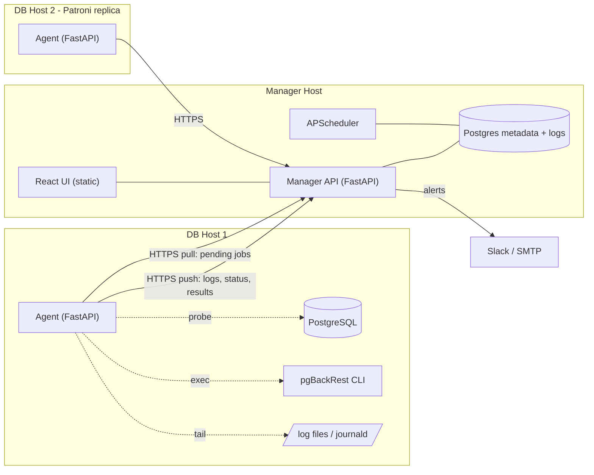

# Postgres Control Tower — Implementation Plan

> **Authoritative plan.** Edit this file freely.
> The Cursor-side plan at `~/.cursor/plans/control_tower_implementation_plan_5d7f4793.plan.md` is kept as a mirror of this file (frontmatter aside) and should be updated whenever this one changes.

## Overview

Unify the pgBackRest Nexus and Diagnostic Hub specs into one product, **Postgres Control Tower** — a single FastAPI manager + lightweight Python agents + React UI, backed by a single Postgres. Ship a v1 prototype with read-only fleet visibility, multi-source log ingestion, safe pgBackRest ops, alerting, and a docker-compose demo environment.

## Phase Checklist

- [x] **P1 — Foundation:** monorepo skeleton, manager+agent FastAPI apps, Postgres schemas `pct` + `logs`, Alembic init, UI JWT login, agent registration endpoint with hashed tokens
- [x] **P2 — Agent registration + heartbeat:** `pct-agent` CLI, heartbeat loop, `last_seen_at`, clock skew capture
- [x] **P3 — pgBackRest data collection + WAL health:** info JSON parser, `pg_stat_archiver` probe, manager `/clusters` endpoints
- [x] **P4 — Log ingestion** for PG, pgBackRest, Patroni, etcd, OS/journald: tailers, UTC normalizer, shipper with disk spool, monthly partitioning, `role_transitions` derivation
- [x] **P5 — UI read paths:** Vite + Tailwind + shadcn/ui dark, Dashboard, Cluster detail with Recharts retention timeline, Logs Surgeon view with UTC sync + RCA hints
- [x] **P6 — Safe Ops:** `jobs` table, agent job runner, Jobs UI for Backup (Full/Diff/Incr), Check, Stanza-create with confirmation; restore/delete blocked in code; recurring `backup_schedules` (cron, UTC) fired by APScheduler
- [x] **P7 — Alerting + clock drift:** Slack + SMTP notifiers, rule engine (backup fail, WAL lag > 60s warn / > 5m crit, clock drift > 2s, role flapping), storage runway forecast
- [x] **P8 — Documentation:** populate `docs/` (architecture, deployment, agent-setup, log-sources, safety-and-rbac, api, hardening, troubleshooting, conflicts-resolved)
- [x] **P9 — Docker Compose demo:** Dockerfiles for manager+agent, compose with Postgres + standalone PG + 2-node Patroni + etcd + agents, `bootstrap.sh` / `teardown.sh` / `reset.sh` / `demo-failures.sh`

---

## 1. Conflict Resolution (vs. original specs)

The two source docs ([docs/_archive/pgbackrest-ui-plan.md](docs/_archive/pgbackrest-ui-plan.md) and [docs/_archive/log-collector.md](docs/_archive/log-collector.md), originally at the repo root, now archived) proposed two parallel agent stacks. We collapse them to favor simplicity and minimum moving parts:

- **Agent runtime** — Nexus says FastAPI Python agent; Log Collector says Vector.dev. **Resolution:** one FastAPI Python agent per host that does both pgBackRest CLI orchestration *and* log tailing. Drops one runtime + config language.
- **Log aggregator** — Log Collector says Grafana Loki. **Resolution:** drop Loki for v1. Logs land in the same Postgres as metadata, in a `logs` table partitioned by day. Revisit Loki only if ingest > a few k events/sec.
- **Task queue** — Nexus says Celery + Redis. **Resolution:** drop Celery and Redis. Use APScheduler in the manager + a `jobs` table that agents poll (long-poll). Adequate for 10–20 clusters.
- **Transport security** — Nexus says mTLS + JWT. **Resolution:** v1 uses HTTPS + a per-agent pre-shared token (stored hashed). mTLS, RBAC roles, and confirmation modals are documented in `docs/hardening.md` as the v2 path.
- **Backend language** — Log Collector says "Python or Go." **Resolution:** Python only, end-to-end.
- **Frontend** — both want React. **Resolution:** React + Vite + Tailwind + shadcn/ui, dark mode default, served as static assets by the manager FastAPI process.
- **Metadata DB** — Nexus says "central Postgres." **Resolution:** same Postgres holds metadata *and* logs, in separate schemas (`pct` and `logs`).

Net result: 3 deployable units (manager image, agent image, postgres). No Redis, Celery, Loki, Vector, or PKI in v1.

## 2. Architecture



**Communication model:** agents always initiate (no inbound ports needed on DB hosts). Two endpoints:
- `POST /v1/agents/heartbeat` — status + WAL health snapshot
- `POST /v1/logs/ingest` — batched log records (UTC-normalized at the agent)
- `GET /v1/jobs/next` — long-poll for pending jobs
- `POST /v1/jobs/{id}/result` — return job stdout/exit

## 3. Tech Stack (locked)

- **Backend (manager + agent):** Python 3.12, FastAPI, SQLAlchemy 2.x, Alembic, Pydantic v2, APScheduler, httpx, uvicorn.
- **DB:** PostgreSQL 16 (single instance for prototype). Native partitioning for `logs.events`.
- **Frontend:** React 18, Vite, TypeScript, TailwindCSS, shadcn/ui, TanStack Query, Recharts (timelines + sparklines).
- **Auth:** UI = JWT (HS256, manager-issued). Agents = Bearer token issued at registration, hashed at rest.
- **Packaging:** `uv` or `pip` + `pyproject.toml`. Docker images (multi-stage). Docker Compose for demo.
- **No Redis, no Celery, no Loki, no Vector, no Nginx (uvicorn is fine for prototype).**

## 4. Repo Layout

```
postgres_control_tower/
  manager/pct_manager/        # FastAPI app + scheduler + ingest + alerter
  manager/alembic/            # migrations
  agent/pct_agent/            # collectors/, runner.py, shipper.py
  web/                        # Vite + React + Tailwind + shadcn/ui
  docs/                       # all documentation lives here
  deploy/docker/              # Dockerfiles
  deploy/compose/             # docker-compose.yml + patroni configs + seeds
  deploy/scripts/             # bootstrap.sh, teardown.sh, demo-failures.sh
  PLAN.md  README.md
```

Original `pgbackrest-ui-plan.md` and `log-collector.md` have been moved to [docs/_archive/](docs/_archive/) with a "superseded" note pointing back here.

## 5. Data Model (v1)

Schema `pct` (metadata):
- `clusters(id, name, kind ['standalone'|'patroni'], created_at)`
- `agents(id, cluster_id, hostname, role ['primary'|'replica'|'unknown'], token_hash, last_seen_at, version, clock_skew_ms)`
- `pgbackrest_info(agent_id, captured_at, payload jsonb)` — last N snapshots
- `wal_health(agent_id, captured_at, last_archived_wal, archive_lag_seconds, gap_detected bool)`
- `jobs(id, agent_id, kind ['backup_full'|'backup_diff'|'backup_incr'|'check'|'stanza_create'], params jsonb, status, requested_by, created_at, started_at, finished_at, exit_code, stdout_tail)`
- `backup_schedules(id, cluster_id, kind ['backup_full'|'backup_diff'|'backup_incr'], cron_expression, params jsonb, enabled, created_at, created_by, last_run_at, last_job_id, next_run_at)` — fired by an APScheduler tick that inserts `jobs` rows when due. Schedules only carry the three backup kinds; `check`/`stanza_create` stay one-off.
- `alerts(id, kind, severity, cluster_id, opened_at, resolved_at, payload jsonb)`
- `users(id, email, password_hash, role)` — `viewer`/`admin`, used only for UI

Schema `logs` (high-volume):
- `logs.events(ts_utc, agent_id, source ['postgres'|'pgbackrest'|'patroni'|'etcd'|'os'], severity, raw, parsed jsonb)` — partitioned monthly, retention configurable (default 14 days), btree index on `(agent_id, ts_utc)`, GIN on `parsed`.
- `logs.role_transitions(ts_utc, agent_id, from_role, to_role, source ['patroni'|'etcd'])` — feeds the Gantt timeline.

## 6. Components & Responsibilities

**Manager** (`manager/pct_manager/`)
- `main.py` — FastAPI app, mounts `/api/v1/*`, serves built `web/dist` at `/`.
- `routes/agents.py` — registration, heartbeat, list.
- `routes/logs.py` — batched ingest (`POST`) + query (`GET` with filters: cluster, source, severity, time range, free-text on `parsed->>'message'`).
- `routes/backups.py` — fleet view, per-cluster pgBackRest info JSON.
- `routes/jobs.py` — create, list, claim (`/next`), submit result.
- `routes/alerts.py` — list/ack.
- `scheduler.py` (APScheduler) — periodic: refresh forecasts, partition maintenance, evaluate alert rules (WAL lag > 60s warn / > 5m crit, backup failure, clock drift > 2s, role-flapping), retention purge.
- `alerter.py` — Slack webhook + SMTP. Plug-in style (`Notifier` base class) so PagerDuty/Teams can be added later.

**Agent** (`agent/pct_agent/`)
- `main.py` — local FastAPI on `127.0.0.1` only for diagnostics. Main work loop is `asyncio.gather` of: shipper, job-runner, collectors.
- `collectors/pgbackrest.py` — every 60s: `pgbackrest --output=json info` → parsed → POST.
- `collectors/wal.py` — queries `pg_stat_archiver` + `pg_last_wal_replay_lsn()` etc., computes archive lag and gap detection.
- `collectors/pg_logs.py`, `pgbr_logs.py`, `patroni_logs.py`, `etcd_logs.py`, `os_logs.py` — file tailers (rotation-aware via `inotify` / polling fallback). `os_logs.py` reads `journalctl -f` for OOM Killer + I/O errors.
- All collectors emit a normalized `LogRecord(ts_utc, source, severity, raw, parsed)`. UTC normalization happens here using the host TZ + NTP-reported skew (ships `clock_skew_ms` with each heartbeat).
- `shipper.py` — buffered batches (size N or T seconds), exponential backoff, on-disk spool when manager is unreachable.
- `runner.py` — claims jobs from `/v1/jobs/next`, executes via `subprocess`, streams stdout to logs and final result back. Allowed kinds in v1: `backup_full|diff|incr`, `check`, `stanza_create`. Restore/delete are *blocked at the agent level* (defense in depth) and unlocked in v2.

**Web** (`web/`)
- `pages/Dashboard.tsx` — global health cards (storage, 24h success, alerts, WAL health) + fleet grid.
- `pages/Cluster.tsx` — per-cluster: pgBackRest retention timeline (Recharts Gantt), WAL sparkline, recent jobs, agent details.
- `pages/Logs.tsx` — "The Surgeon": multi-node UTC-synchronized stream, source/severity filters, free-text search, RCA hint panel (rule-based: "OOM in OS source within 30s of Patroni leader change → suggest 'OOM caused failover'").
- `pages/Jobs.tsx` — submit Backup / Check / Stanza-create with confirmation, watch progress.
- `pages/Alerts.tsx` — open + ack.
- Auto-refresh every 5 min; "Instant Snap" button forces refresh (the "Pulse / Zap" UX from the log-collector spec).

## 7. Implementation Phases

Phases run sequentially; each ends in something demoable.

- **P1 — Foundation.** Monorepo skeleton, `pyproject.toml`s, base FastAPI apps, Alembic init, schemas `pct` + `logs`, JWT login for UI, agent registration endpoint, agent token hashing.
- **P2 — Agent registration + heartbeat.** Bootstrap CLI (`pct-agent register --manager-url ... --enrollment-token ...`), heartbeat loop, manager records `last_seen_at` and clock skew.
- **P3 — pgBackRest data + WAL health.** `pgbackrest info` parser → `pgbackrest_info`; WAL probe → `wal_health`; manager exposes `/clusters` and `/clusters/{id}`.
- **P4 — Log ingestion (all 5 sources).** Tailers, UTC normalizer, shipper with disk spool, partition maintenance job, basic parsers per source (regex + line-format awareness), `role_transitions` derivation from Patroni/etcd lines.
- **P5 — UI read paths.** Vite scaffold, Tailwind + shadcn/ui, dark mode default, Dashboard + Cluster + Logs pages, Recharts for timeline + sparklines, retention "Safety Window" visualization, RCA hints v1 (3–5 hardcoded rules).
- **P6 — Safe Ops.** `jobs` table, agent runner, Jobs page with confirmation dialog (no "type cluster name" yet — that lands with destructive ops in v2). Allowed kinds enforced both in API and in agent runner.
- **P7 — Alerting + clock drift.** Slack + SMTP notifiers, rule engine in `scheduler.py`, alert dedup window, "Storage Runway" linear regression on `pgbackrest_info.payload->repo->size`.
- **P8 — Documentation.** Populate `docs/` (see §8).
- **P9 — Docker Compose demo.** Multi-container demo environment with a real Patroni HA cluster + a standalone PG, pre-registered agents, seeded fake history, and a script to inject failures.

## 8. Documentation (`docs/`)

All markdown, kept current alongside code. Files:

- [docs/README.md](docs/README.md) — index + reading order.
- [docs/architecture.md](docs/architecture.md) — diagrams, component responsibilities, data flow, API surface.
- [docs/deployment.md](docs/deployment.md) — production-ish deploy: TLS termination, Postgres sizing, retention tuning, backups of the manager DB itself.
- [docs/agent-setup.md](docs/agent-setup.md) — install, register, configure log sources, troubleshoot.
- [docs/log-sources.md](docs/log-sources.md) — required file paths / journald units per source, parser format examples, how to add a new source.
- [docs/safety-and-rbac.md](docs/safety-and-rbac.md) — what v1 can and cannot do, why restore/delete are deferred, the v2 confirmation-modal design.
- [docs/api.md](docs/api.md) — API reference (auto-generated from OpenAPI + hand-written guides).
- [docs/hardening.md](docs/hardening.md) — v2 path: mTLS, RBAC roles, audit logging, secret management.
- [docs/troubleshooting.md](docs/troubleshooting.md) — common issues (clock skew, missing perms for journalctl, agent token rotation).
- [docs/conflicts-resolved.md](docs/conflicts-resolved.md) — durable record of the §1 decisions; future contributors will ask "why no Loki?".

## 9. Docker Compose Demo (final phase)

Goal: `bash deploy/scripts/bootstrap.sh` brings up a complete, browseable demo on a laptop in under 2 minutes.

`deploy/compose/docker-compose.yml` services:
- `postgres-mgr` — manager DB.
- `manager` — `Dockerfile.manager`, runs migrations on start, serves UI at `:8080`.
- `pg-standalone` — single PG with pgBackRest configured against a local repo.
- `etcd1` — single-node etcd for the Patroni demo (keep it 1-node for simplicity; clearly noted in docs that production needs 3).
- `patroni-1`, `patroni-2` — 2-node Patroni cluster (primary + replica) sharing pgBackRest.
- `pct-agent-standalone`, `pct-agent-patroni-1`, `pct-agent-patroni-2` — one agent per DB container, sidecar-style (same container or sibling — pick sibling with shared volume for log file access; documented either way).

`deploy/scripts/`:
- `bootstrap.sh` — `docker compose build && up -d`, wait for manager health, auto-register agents using a one-time enrollment token printed by the manager, seed demo `clusters` rows.
- `teardown.sh` — `docker compose down -v`.
- `reset.sh` — teardown + bootstrap.
- `demo-failures.sh` — injects scenarios: (a) kill primary to trigger Patroni failover, (b) `chmod 000` on pgBackRest repo to fail next backup, (c) write a fake OOM line to journald, (d) freeze WAL archiving for 20 min to fire WAL-lag alert.

A short "Try it" section in [README.md](README.md) points the user at `bootstrap.sh` and `http://localhost:8080`.

## 10. Out of scope for v1 (recorded for future work)

PITR restore UI, stanza-delete, config push & drift detection, RBAC roles beyond viewer/admin, "type cluster name to confirm" modals, mTLS, PagerDuty/Teams, multi-tenant, log retention archival to S3, Loki backend, Celery for parallel restores.
