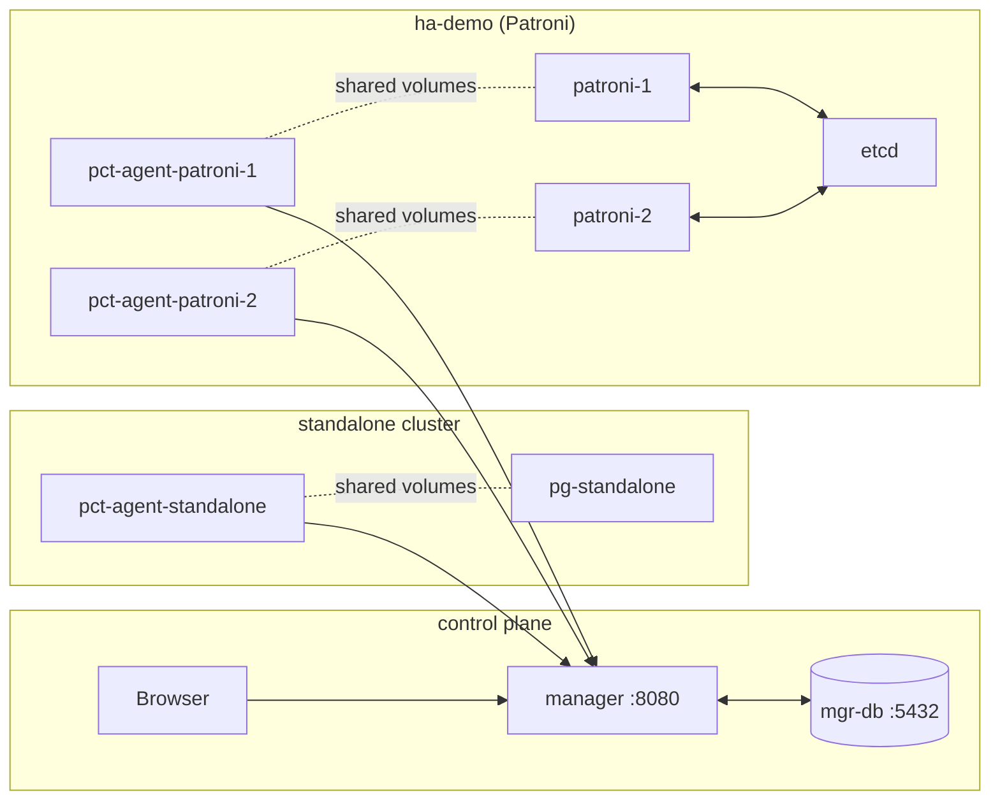

# PCT demo — Docker Compose

A self-contained Postgres Control Tower demo that boots, in a single
`docker compose` project:

- the manager (FastAPI + APScheduler + bundled SPA)
- a dedicated control-plane Postgres (`mgr-db`)
- one **standalone** Postgres 16 cluster (`pg-standalone`)
- one **Patroni HA** cluster of two nodes (`patroni-1`, `patroni-2`) backed by `etcd`
- a sibling `pct-agent` container per data-plane Postgres

It is for demos, exploration and (lightly) integration testing.
**Do not deploy this layout in production** — see [docs/deployment.md](../docs/deployment.md)
and [docs/hardening.md](../docs/hardening.md) for the production checklist.

---

## Topology



Agents and Postgres run in **sibling containers** with shared named volumes
for log dirs, the pgBackRest repo, and the Postgres unix socket directory.
This matches the deployment story documented in
[docs/agent-setup.md](../docs/agent-setup.md) (a sibling agent on the same
host as Postgres) without forcing you to bake everything into one image.

---

## Quick start

Requires Docker Desktop or a recent Docker Engine + Compose v2.
First-time builds compile the SPA and download Postgres / Patroni
packages, so allow ~5 minutes.

```bash
./deploy/scripts/bootstrap.sh
# … wait …
open http://localhost:8080         # macOS
xdg-open http://localhost:8080     # linux
```

The bootstrap script:

1. Generates `deploy/compose/.env` (random JWT secret, enrollment token,
   admin password) on first run.
2. Builds the four custom images
   ([Dockerfile.manager](docker/Dockerfile.manager),
    [Dockerfile.agent](docker/Dockerfile.agent),
    [Dockerfile.pg-with-pgbr](docker/Dockerfile.pg-with-pgbr),
    [Dockerfile.patroni](docker/Dockerfile.patroni)).
3. `docker compose up -d` and waits for every service's healthcheck.
4. Logs into the manager and queues `stanza_create` + `backup_full`
   jobs against both clusters so the UI has something to render.

Admin credentials are printed at the end and persisted in
`deploy/compose/.env`.

### Stop / wipe

```bash
./deploy/scripts/teardown.sh   # stop containers, keep data
./deploy/scripts/reset.sh      # stop + delete every named volume
```

---

## Failure scenarios

`deploy/scripts/demo-failures.sh` triggers four scripted scenarios so
you can watch PCT detect, alert, and (where applicable) heal:

| Scenario              | What it does                                          | What to watch                                        |
|-----------------------|-------------------------------------------------------|------------------------------------------------------|
| `wal_lag`             | breaks `archive_command` on `pg-standalone`           | `wal_lag` alert opens within 15m; lag chart climbs   |
| `failover`            | `docker compose stop patroni-1`                       | Patroni promotes `patroni-2`; role transitions logged|
| `backup_fail`         | queues `backup_full` against a non-existent stanza    | Job ends `failed`; `backup_failed` alert opens       |
| `clock_drift`         | sets agent container clocks 10s in the past           | `clock_drift` alert within ~60s                      |
| `restore` (rejected)  | tries to queue a `restore` job                        | Manager replies `422`; never reaches the agent       |

The last scenario doubles as a smoke test for the safety contract in
[docs/safety-and-rbac.md](../docs/safety-and-rbac.md): destructive
pgBackRest commands are not in the kind allowlist, the manager rejects
them up front, and the agent runner has its own copy of the allowlist
in case the manager is ever compromised.

---

## Layout

```
deploy/
├── docker/
│   ├── Dockerfile.manager           # SPA build + Python runtime + alembic
│   ├── Dockerfile.agent             # Python + pgbackrest + libpq + gosu
│   ├── Dockerfile.pg-with-pgbr      # postgres:16 + pgbackrest + custom conf
│   ├── Dockerfile.patroni           # PG16 + Patroni + pgbackrest (debian)
│   ├── entrypoint-manager.sh        # alembic upgrade head, then exec uvicorn
│   └── entrypoint-agent.sh          # one-shot register, then exec pct-agent
├── compose/
│   ├── docker-compose.yml           # the whole topology
│   ├── .env.example                 # demo secrets template
│   └── conf/
│       ├── standalone/              # postgresql.conf, pg_hba, pgbackrest.conf, init.sh
│       ├── patroni/                 # patroni.yml.tmpl, pgbackrest.conf, entrypoint.sh
│       ├── agent-standalone/        # pct-agent config.yaml for the standalone sidecar
│       ├── agent-patroni-1/         # pct-agent config.yaml for HA node 1
│       └── agent-patroni-2/         # pct-agent config.yaml for HA node 2
├── scripts/
│   ├── bootstrap.sh                 # build + up + wait + seed
│   ├── teardown.sh                  # stop, keep volumes
│   ├── reset.sh                     # stop + delete volumes
│   └── demo-failures.sh             # the five scenarios
└── README.md                        # you are here
```

---

## Things to check

After `bootstrap.sh` finishes, the UI should show:

- **Dashboard** — 2 clusters, 3 agents, 0 open alerts, recent jobs.
- **Cluster `standalone`** — primary `pg-standalone`, recent backup, WAL
  lag near zero, storage runway populated after the second forecast pass.
- **Cluster `ha-demo`** — primary = whichever of patroni-1/patroni-2 won
  the leader election, the other listed as replica.
- **Logs** — the surgeon view tails Postgres / pgBackRest / Patroni /
  etcd / OS lines from all three agents in UTC-normalised order.
- **Jobs** — the `stanza_create` and `backup_full` rows queued by
  `bootstrap.sh`, both `succeeded`.

If any of those are missing, see
[docs/troubleshooting.md](../docs/troubleshooting.md) — the symptom
table there covers the most likely failure modes for the demo too.
