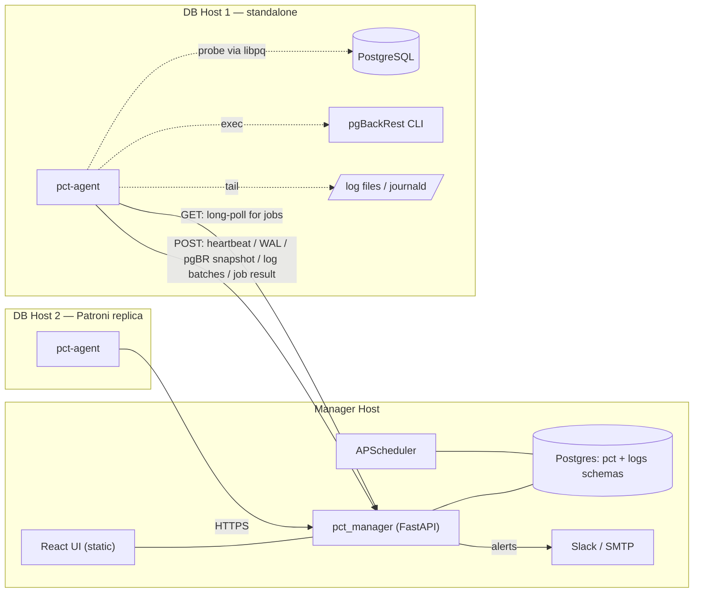
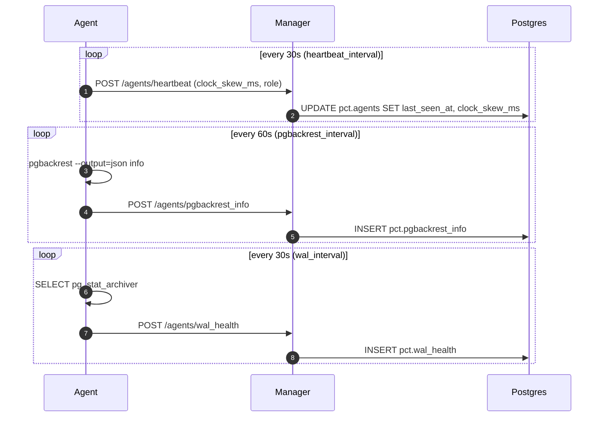
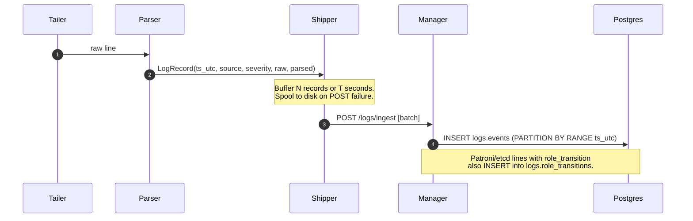
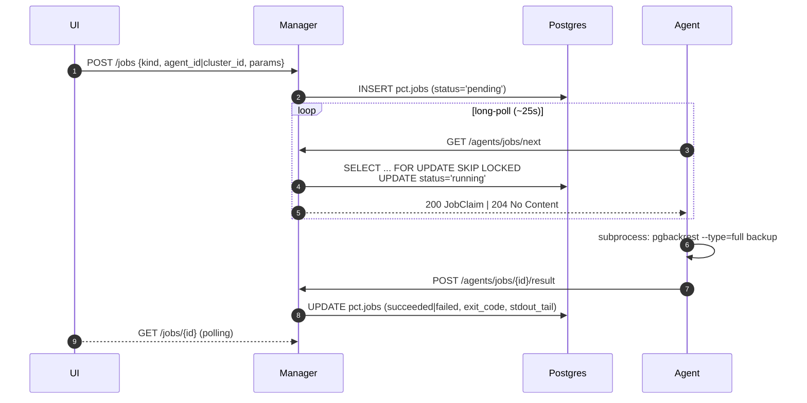
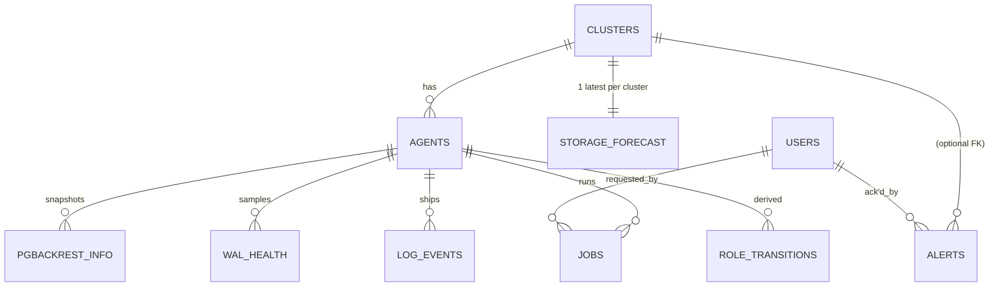

# Architecture

This page is the technical "how it works" reference for Postgres Control
Tower (PCT).
The locked decisions live in [`PLAN.md` §1–§7](../PLAN.md#1-conflict-resolution-vs-original-specs);
this doc just elaborates them with the diagrams, schemas, and call paths
the manager and agent actually implement today.

If you only have time for one section, read **Components** (below) and
**Data flow** — they cover 80% of what changes when you read the source.

## Goals and non-goals

PCT aims to be the answer to "what is going on with our PostgreSQL
fleet, and what backups do we have?" — for a fleet of **10–20 clusters**
operated by a small team.

In scope today (v1):

- Read-only fleet visibility (clusters, agents, WAL health, pgBackRest).
- Multi-source log ingest (Postgres, pgBackRest, Patroni, etcd, OS).
- Safe pgBackRest ops: `backup`, `check`, `stanza-create` only.
- Slack + SMTP alerts: WAL lag, backup failure, clock drift, role flapping.
- Storage runway forecast.

Explicitly **out of scope** for v1 (see [`PLAN.md` §10](../PLAN.md#10-out-of-scope-for-v1-recorded-for-future-work)):

- PITR restore UI, `stanza-delete`, config push.
- mTLS, RBAC beyond `viewer`/`admin`, audit logging.
- Loki / Vector / Celery / Redis (deliberately removed; see
  [`conflicts-resolved.md`](conflicts-resolved.md)).

## Deployable units

Three things ship; nothing else.

| Unit             | What it is                                                                  | Where it runs                                |
| ---------------- | --------------------------------------------------------------------------- | -------------------------------------------- |
| **Manager**      | FastAPI app + APScheduler + static UI bundle.                                | One container (or VM) per environment.       |
| **Agent**        | `pct-agent` Python process (FastAPI on `127.0.0.1` for diagnostics).         | One per DB host (sidecar or co-located).     |
| **Postgres 16**  | Single instance, two schemas (`pct` + `logs`).                              | One container; can be an existing managed PG. |

No Redis, no Celery, no Loki, no Vector, no PKI in v1.

## Components

### Manager — `manager/pct_manager/`

| Module                        | Responsibility                                                                         |
| ----------------------------- | -------------------------------------------------------------------------------------- |
| `main.py`                     | FastAPI app, lifespan (scheduler, startup jobs), `web/dist` static mount, CORS.        |
| `routes/auth.py`              | `POST /auth/login`, `GET /auth/me`. Issues HS256 JWTs.                                 |
| `routes/agents.py`            | Registration, heartbeat, WAL & pgBR ingest, job long-poll, job result.                  |
| `routes/clusters.py`          | Fleet read paths + `GET /clusters/{id}/storage_forecast`.                              |
| `routes/logs.py`              | Batched ingest (`POST /logs/ingest`) + querying (`GET /logs/events`, `role_transitions`). |
| `routes/jobs.py`              | UI-side `POST /jobs`, `GET /jobs`, `GET /jobs/{id}`. Admin-gated for create.            |
| `routes/alerts.py`            | List, summary, ack.                                                                    |
| `scheduler.py`                | APScheduler bootstrap; partition maintenance, retention purge, alert eval, forecast.    |
| `partitions.py`               | Monthly `CREATE PARTITION` + retention drop for `logs.events`.                         |
| `alerter/`                    | Rule engine + notifiers + storage forecast.                                            |
| `db.py`, `models.py`          | SQLAlchemy 2.x setup, ORM models for both schemas.                                     |
| `schemas.py`                  | Pydantic v2 request/response shapes (single source of truth).                          |
| `security.py`                 | Password hashing, JWT issue/verify, `require_admin` dep.                               |
| `web.py`                      | Static SPA mount with hash-fallback to `index.html`.                                   |

### Agent — `agent/pct_agent/`

| Module                                     | Responsibility                                                                  |
| ------------------------------------------ | ------------------------------------------------------------------------------- |
| `cli.py`                                   | `pct-agent register`, `pct-agent run`. Persists per-agent token to disk.        |
| `main.py`                                  | Local diagnostic FastAPI on `127.0.0.1`; lifespan launches all loops.           |
| `manager_client.py`                        | `httpx.AsyncClient` wrapper. Bearer token, retries, long-poll-aware `get`.       |
| `heartbeat.py`                             | Sends `last_seen_at` + clock skew every `PCT_AGENT_HEARTBEAT_INTERVAL` seconds. |
| `collectors/pgbackrest.py`                 | `pgbackrest --output=json info` every minute; ships JSONB snapshot.              |
| `collectors/wal.py`                        | `pg_stat_archiver` + `pg_last_wal_replay_lsn()`; archive lag + gap detection.    |
| `collectors/{pg,pgbr,patroni,etcd}_logs.py`| Rotation-aware tailers, one per source, all funnel into the shipper.            |
| `collectors/os_logs.py`                    | `journalctl -fo json`; OOM Killer + I/O error severity bumps.                   |
| `collectors/host_metrics.py`               | Periodic `/proc` sampler shipped under `source='os'`. Portable fallback for containers without journalctl. |
| `tailer.py`                                | The actual rotation-aware byte tailer used by the file collectors.              |
| `parsers.py`                               | Per-source line → `LogRecord`; severity normalization; role-transition detection.|
| `log_record.py`                            | The `LogRecord` dataclass + UTC normalizer.                                     |
| `shipper.py`                               | Buffered batches, exponential backoff, on-disk spool when manager is down.       |
| `runner.py`                                | Long-polls for jobs, executes `pgbackrest` via `asyncio.subprocess`, reports.    |

### Web — `web/`

Vite + React + TypeScript + Tailwind + hand-rolled shadcn-style primitives,
TanStack Query for data, Recharts for the few charts. See
[`PLAN.md` §6](../PLAN.md#6-components--responsibilities) for the page list.

## Data flow

### 1. Heartbeat + collectors (steady state)

### 2. Log ingest

The agent normalizes timestamps to UTC **before** they reach the wire.
We never re-time on the manager side; clock skew is reported separately
via heartbeat so the UI can flag it.

### 3. Jobs (Safe Ops)

### 4. Alert evaluation + storage forecast

APScheduler runs four periodic jobs in the manager process; all are
idempotent and safe to skip if a previous run is still in flight
(`coalesce=True`, `max_instances=1`):

| Job                          | Cadence (default)                          | Source                                           |
| ---------------------------- | ------------------------------------------ | ------------------------------------------------ |
| `ensure_log_partitions`      | daily 00:10 UTC                            | `partitions.py`                                  |
| `prune_old_log_partitions`   | daily 00:20 UTC                            | `partitions.py` (`PCT_LOG_RETENTION_DAYS`)       |
| `evaluate_alert_rules`       | every 60s (`PCT_ALERT_EVAL_INTERVAL`)      | `alerter/dispatcher.py` + `alerter/rules.py`     |
| `refresh_storage_forecasts`  | every 300s (`PCT_FORECAST_INTERVAL_SECONDS`)| `alerter/forecast.py`                            |

All four also run **once at manager startup** so a fresh deploy isn't
empty until the next cadence tick (see `scheduler.run_startup_jobs`).

## API surface

The HTTP surface is small on purpose. See [`api.md`](api.md) for full
request/response shapes; this is the at-a-glance map.

| Group       | Routes                                                                                  | Auth                                  |
| ----------- | --------------------------------------------------------------------------------------- | ------------------------------------- |
| Auth        | `POST /api/v1/auth/login`, `GET /api/v1/auth/me`                                        | Public; returns/uses JWT.             |
| Clusters    | `GET /api/v1/clusters`, `GET /api/v1/clusters/{id}`, `.../storage_forecast`             | UI JWT (`viewer`).                    |
| Logs read   | `GET /api/v1/logs/events`, `GET /api/v1/logs/events/{id}`, `GET /.../role_transitions`  | UI JWT (`viewer`).                    |
| Jobs read   | `GET /api/v1/jobs`, `GET /api/v1/jobs/{id}`                                             | UI JWT (`viewer`).                    |
| Jobs write  | `POST /api/v1/jobs`                                                                     | UI JWT (`admin`).                     |
| Alerts      | `GET /api/v1/alerts`, `/summary`, `POST /alerts/{id}/ack`                               | Read viewer; ack admin.               |
| Agent in    | `POST /agents/{register,heartbeat,pgbackrest_info,wal_health}`                          | Enroll token / agent bearer token.    |
| Agent jobs  | `GET /api/v1/agents/jobs/next`, `POST /api/v1/agents/jobs/{id}/result`                  | Agent bearer token.                   |
| Logs ingest | `POST /api/v1/logs/ingest`                                                              | Agent bearer token.                   |

## Database schema

Two schemas in one PostgreSQL 16 instance.
The full DDL lives in [`manager/alembic/versions/`](../manager/alembic/versions/);
ORM models in [`manager/pct_manager/models.py`](../manager/pct_manager/models.py).

Notes that matter when you read the code:

- `logs.events` is `PARTITION BY RANGE (ts_utc)` (monthly); the partition
  key is in the PK, which is why `id` alone is not unique.
- `pct.alerts` deduplicates on `(kind, cluster_id, dedup_key)` — the rule
  engine merges payload changes into an open row instead of opening a
  new one. See [`alerter/dispatcher.py`](../manager/pct_manager/alerter/dispatcher.py).
- `pct.storage_forecast` keeps only the **latest** prediction per
  cluster (unique on `cluster_id`); we don't archive predictions.
- `pct.jobs` keeps only the last ~16KB of stdout in `stdout_tail`; the
  full pgBackRest stream lands in `logs.events` via the pgBackRest log
  tailer.

## Authentication & transport

There are two distinct credential surfaces, intentionally separate.

**UI users.**
A bootstrap admin can be auto-created on startup via
`PCT_BOOTSTRAP_ADMIN_EMAIL` / `PCT_BOOTSTRAP_ADMIN_PASSWORD`.
Login returns an HS256 JWT (signed with `PCT_JWT_SECRET`); the SPA
stores it in `localStorage` and sends it as `Authorization: Bearer ...`.
Roles are `viewer` and `admin` only — see
[`safety-and-rbac.md`](safety-and-rbac.md).

**Agents.**
A pre-shared `PCT_ENROLLMENT_TOKEN` lets a fresh agent call
`POST /api/v1/agents/register` exactly once.
The manager generates a per-agent bearer token, **stores only the
hash**, and returns the plaintext to the agent.
Every subsequent call from that agent uses
`Authorization: Bearer <agent-token>`; the manager hashes the incoming
token and looks it up.
Token rotation = re-register the agent (simple, see
[`troubleshooting.md`](troubleshooting.md)).

Transport is HTTPS-or-localhost; mTLS is the v2 path documented in
[`hardening.md`](hardening.md).

## Failure modes (what the design assumes)

- **Manager unreachable.** Agents keep tailing logs; the shipper
  buffers in memory and spools to `PCT_AGENT_SPOOL_DIR` on disk. Once
  the manager comes back, the spool drains.
- **Agent dies mid-job.** The job stays in `running` until manual
  intervention (no automatic re-claim in v1). The cluster page shows
  `last_seen_at` going stale.
- **Postgres dies.** Manager errors out on every request; agents
  spool. There is no in-memory cache, by design.
- **Clock skew.** Reported by every heartbeat; rule engine alerts on
  `|skew| > 2000 ms`. UI flips the agent badge red.
- **Log volume spike.** `logs.events` is partitioned monthly and
  pruned per `PCT_LOG_RETENTION_DAYS`. If you outgrow Postgres for log
  volume, see "Future Work" in [`hardening.md`](hardening.md).

## Future work

The v2 path is detailed in [`hardening.md`](hardening.md):
mTLS between agent ↔ manager, RBAC roles beyond `viewer`/`admin`,
audit logging, secret management, and the destructive-op confirmation
modal.
