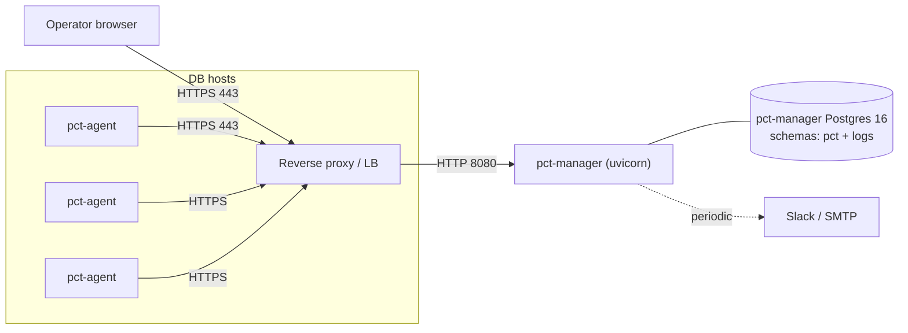

# Deployment

This page is a production-leaning deployment guide for PCT.
For a one-laptop demo, the docker-compose path documented in
[`PLAN.md` §9](../PLAN.md#9-docker-compose-demo-final-phase) is much
simpler — use that for evaluation.

What you'll find here:

1. Reference topology.
2. TLS termination at the edge.
3. Sizing the manager Postgres for a 10–20 cluster fleet.
4. Tuning log retention.
5. Backing up the manager DB itself (the most-overlooked step).

Agent installation lives in its own page:
[`agent-setup.md`](agent-setup.md).

## Reference topology

For a real deployment, three Postgres-adjacent moving parts ride on
the production network and talk to one manager process:



Three deployable units (manager image, agent image, Postgres),
nothing else. See [`architecture.md`](architecture.md#deployable-units).

## 1. Provision Postgres for the manager

The manager DB is a single PostgreSQL 16 instance dedicated to PCT.
You can use a managed PG (RDS, Cloud SQL, Crunchy, etc.) — PCT only
needs a regular role with `CREATE` on the database it owns.

```sql
-- as a superuser on the manager Postgres
CREATE ROLE pct LOGIN PASSWORD 'change-me-strong';
CREATE DATABASE pct OWNER pct;
```

The migration command will create the `pct` and `logs` schemas on
first boot.

**Sizing rules of thumb** (for 10–20 clusters / ~30 agents):

| Resource           | Suggested baseline                                      | Why                                                                                         |
| ------------------ | ------------------------------------------------------- | ------------------------------------------------------------------------------------------- |
| vCPU               | 2 vCPU                                                  | Read paths dominate; ingest is batched.                                                     |
| RAM                | 4–8 GB (`shared_buffers ≈ 25%`)                         | The GIN index on `logs.events.parsed` benefits from caching.                                |
| Disk (steady)      | ~5 GB / cluster / month at typical PG log volume        | Adjust by your `log_min_messages`. See "Tuning log retention" below.                        |
| Disk (peak)        | 2× steady (rotation + WAL + index churn)                | Allow headroom for unexpected log floods (a tight loop in the app dumps GB fast).           |
| `max_connections`  | 100                                                     | Manager pool is ~20; reserve room for adhoc psql + replicas.                                |
| WAL / archiving    | Standard managed-PG defaults are fine.                  | The manager DB itself is not under heavy write pressure.                                    |

`logs.events` is partitioned monthly so vacuum stays bounded.
The scheduler (`scheduler.py`) creates next-month partitions daily at
00:10 UTC and drops expired ones at 00:20 UTC.

## 2. Run the manager

The manager is a stock FastAPI + uvicorn app. Three things to set:

| Env var                         | What it controls                                                  |
| ------------------------------- | ----------------------------------------------------------------- |
| `PCT_DATABASE_URL`              | SQLAlchemy URL for the manager Postgres above.                    |
| `PCT_JWT_SECRET`                | HS256 signing secret for UI session JWTs. Use a long random string. |
| `PCT_ENROLLMENT_TOKEN`          | The pre-shared secret an agent presents on first registration.    |
| `PCT_BOOTSTRAP_ADMIN_EMAIL` / `PCT_BOOTSTRAP_ADMIN_PASSWORD` | Auto-create the first admin if one doesn't exist. |
| `PCT_LOG_RETENTION_DAYS`        | How long to keep `logs.events`. Default 14.                       |
| `PCT_WEB_DIST_DIR`              | Path to the built Vite app (`web/dist`). Set in the prod image.   |
| `PCT_CORS_ALLOW_ORIGINS`        | Comma-separated origins. Empty in prod (same origin).             |
| `PCT_ARTIFACTS_DIR`             | Filesystem dir for job artifact uploads (e.g. pt-stalk bundles). Default `/var/lib/pct-manager/artifacts`. Mount a dedicated volume here. |
| `PCT_MAX_ARTIFACT_BYTES`        | Per-upload size cap in bytes. Default `209715200` (200 MiB).      |

The full set is in [`.env.example`](../.env.example) at the repo root.

A minimal Docker run looks like this (the actual production
`Dockerfile.manager` lives under `deploy/docker/`):

```bash
docker run -d --name pct-manager \
  -e PCT_DATABASE_URL="postgresql+psycopg://pct:...@db:5432/pct" \
  -e PCT_JWT_SECRET="$(openssl rand -hex 32)" \
  -e PCT_ENROLLMENT_TOKEN="$(openssl rand -hex 32)" \
  -e PCT_BOOTSTRAP_ADMIN_EMAIL="ops@example.com" \
  -e PCT_BOOTSTRAP_ADMIN_PASSWORD="$(openssl rand -base64 24)" \
  -e PCT_WEB_DIST_DIR="/srv/web" \
  -v pct-artifacts:/var/lib/pct-manager/artifacts \
  -p 8080:8080 \
  ghcr.io/yourorg/pct-manager:0.1
```

The `pct-artifacts` named volume holds binary uploads from agents
(today only pt-stalk bundles); these can run to hundreds of MiB per
job, so a dedicated volume that survives container rebuilds is
strongly recommended over a bind mount under the container's writable
layer.

The manager runs Alembic migrations automatically at startup if the
schema is behind, then serves `/api/v1/*` and the static SPA at `/`.

To run migrations manually (e.g. in a release pipeline pre-deploy):

```bash
cd manager && alembic upgrade head
```

### Long-running on a single host

Uvicorn with one worker is enough for v1's expected request volume.
If you want to use systemd directly:

```ini
# /etc/systemd/system/pct-manager.service
[Unit]
Description=Postgres Control Tower manager
After=network-online.target

[Service]
Type=simple
User=pct
EnvironmentFile=/etc/pct-manager/env
ExecStart=/opt/pct-manager.venv/bin/uvicorn pct_manager.main:app \
    --host 127.0.0.1 --port 8080 --workers 1
Restart=on-failure
RestartSec=5

[Install]
WantedBy=multi-user.target
```

We deliberately bind `127.0.0.1` and let the reverse proxy handle TLS
and public exposure. See next section.

## 3. TLS termination at the edge

Run TLS termination at a reverse proxy in front of the manager.
Caddy / nginx / Traefik / a managed load balancer — any of them is
fine.

What the proxy needs to do:

- Terminate TLS with a real certificate (Let's Encrypt is fine).
- Forward `/` and `/api/v1/*` to the manager on `127.0.0.1:8080`.
- Pass `Authorization` headers through unmodified.
- Set `X-Forwarded-Proto: https` so the manager knows it's behind a
  proxy.

Minimal Caddyfile:

```caddy
pct.internal {
    encode zstd gzip
    reverse_proxy 127.0.0.1:8080
}
```

Minimal nginx server block:

```nginx
server {
    listen 443 ssl http2;
    server_name pct.internal;
    ssl_certificate     /etc/ssl/pct/fullchain.pem;
    ssl_certificate_key /etc/ssl/pct/privkey.pem;

    location / {
        proxy_pass         http://127.0.0.1:8080;
        proxy_http_version 1.1;
        proxy_set_header   Host $host;
        proxy_set_header   X-Real-IP $remote_addr;
        proxy_set_header   X-Forwarded-For $proxy_add_x_forwarded_for;
        proxy_set_header   X-Forwarded-Proto https;
        # Long-poll for /agents/jobs/next can sit ~30s. Don't 504.
        proxy_read_timeout 90s;
    }
}
```

The `proxy_read_timeout 90s` matters because `GET
/api/v1/agents/jobs/next` long-polls (~25s by default) and a 30s
proxy timeout will sever it cleanly mid-poll. Pick at least
`PCT_AGENT_RUNNER_LONG_POLL_SECONDS + 30`.

## 4. Tune log retention

Logs land in `logs.events`, a monthly-partitioned table. Disk usage
is roughly proportional to:

- number of agents,
- the verbosity of `log_min_messages` on each Postgres,
- the chattiness of pgBackRest backup runs (full backups generate
  many lines).

The two knobs to adjust:

| Knob                              | Where           | Effect                                                  |
| --------------------------------- | --------------- | ------------------------------------------------------- |
| `PCT_LOG_RETENTION_DAYS`          | Manager env     | How far back to keep events.                            |
| `log_min_messages` on each PG     | `postgresql.conf` | Drop everything below WARNING for noisy clusters.      |

Rule of thumb for a fresh deploy: start at 14 days
(`PCT_LOG_RETENTION_DAYS=14`), monitor the size of
`logs.events_*` partitions for a week with:

```sql
SELECT
  schemaname,
  tablename,
  pg_size_pretty(pg_total_relation_size(schemaname || '.' || tablename)) AS size
FROM pg_tables
WHERE schemaname = 'logs' AND tablename LIKE 'events_%'
ORDER BY tablename DESC;
```

If a single month is growing past, say, 50 GB on the manager DB, go
back and either lower retention or quiet down the chattiest source
(usually `pg_logs` with `DEBUG` enabled — not what you want in prod
anyway).

Pruning is **partition-based** (drop, not delete), so it's cheap and
predictable. See `partitions.prune_old_log_partitions`.

## 5. Back up the manager DB

The manager DB holds:

- Agent enrollments + token hashes.
- The full job history.
- The full alert history.
- Every log event (until pruned).

If you lose it, agents must be re-registered (token rotation by
necessity), the Logs UI goes empty for the retention window, and
historical alerts are gone. Don't lose it.

**Recommended:**

- `pg_dump --format=custom --no-owner` on a daily schedule.
  Compressed. Off-host.
- WAL archiving via your Postgres provider's normal mechanism (PITR
  to last 7 days is plenty).

If you're feeling ironic about it: yes, use **pgBackRest** to back
up the manager DB. Same product, doesn't depend on PCT itself
running, and the pgBackRest agent on that host can also be a normal
PCT agent reporting in. See "Eat your own dog food" in
[`hardening.md`](hardening.md).

A tiny restore drill once a quarter prevents the "we have backups,
they are unreadable" failure mode.

## Production checklist

Before announcing it as production:

- [ ] Manager Postgres has its own backup + verified restore drill.
- [ ] `PCT_JWT_SECRET` is a long random string from a secret manager,
      not the default.
- [ ] `PCT_ENROLLMENT_TOKEN` is a long random string and is rotated
      after the initial fleet enrollment.
- [ ] Bootstrap admin password is rotated; the auto-create env vars
      are no longer in the manager environment.
- [ ] TLS is terminated at the edge; the manager binds `127.0.0.1`.
- [ ] Reverse proxy `proxy_read_timeout` is `>= long_poll + 30s`.
- [ ] At least one notifier (Slack or SMTP) is configured, verified
      with a test alert.
- [ ] Each DB host runs `pct-agent` under a dedicated system user
      with `systemd-journal` group membership.
- [ ] `/var/lib/pct-agent/state.json` is `0600 pct-agent:pct-agent`.
- [ ] The Cluster page shows `last_seen_at` within the last minute
      for every agent.
- [ ] The Logs page shows lines from every source you intended to
      enable.
- [ ] A test backup job has been submitted from the UI and shows up
      green.

## Related

- [`agent-setup.md`](agent-setup.md) — install + register an agent.
- [`hardening.md`](hardening.md) — v2 path: mTLS, RBAC, audit log,
  secrets.
- [`troubleshooting.md`](troubleshooting.md) — what to do when an
  alarm goes off.
- [`PLAN.md` §9](../PLAN.md#9-docker-compose-demo-final-phase) — the
  one-laptop demo path.
