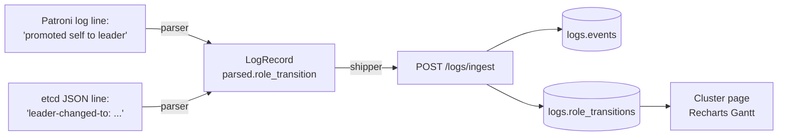

# Log sources

This page documents the **five log sources** PCT collects, the
canonical paths and journald units to point each tailer at, what the
parser produces, and how to add a sixth.

For installation, see [`agent-setup.md`](agent-setup.md).
The parsers are in
[`agent/pct_agent/parsers.py`](../agent/pct_agent/parsers.py); the
collectors are in [`agent/pct_agent/collectors/`](../agent/pct_agent/collectors/).

## The 5 sources at a glance

| Source       | Collector module              | Default config knob               | Default reader        | What we do with it                                          |
| ------------ | ----------------------------- | --------------------------------- | --------------------- | ----------------------------------------------------------- |
| `postgres`   | `collectors/pg_logs.py`       | `PCT_AGENT_PG_LOG_PATHS`          | rotation-aware tailer | severity, slow queries, errors                              |
| `pgbackrest` | `collectors/pgbr_logs.py`     | `PCT_AGENT_PGBACKREST_LOG_PATHS`  | rotation-aware tailer | backup progress, archive-push, fail history                 |
| `patroni`    | `collectors/patroni_logs.py`  | `PCT_AGENT_PATRONI_LOG_PATHS`     | rotation-aware tailer | leader-election lines → `logs.role_transitions`             |
| `etcd`       | `collectors/etcd_logs.py`     | `PCT_AGENT_ETCD_LOG_PATHS`        | rotation-aware tailer | consensus health, leader changes (JSON or text)             |
| `os`         | `collectors/os_logs.py`       | `PCT_AGENT_OS_LOG_PATHS`          | `journalctl -fo json` | OOM Killer, I/O errors, severity bumps                      |

A source with an empty path knob is **disabled**.
Each tailer is rotation-aware (size-shrink + inode-change detection)
and survives `logrotate` without dropping lines.

Every line eventually becomes a normalized
[`LogRecord(ts_utc, source, severity, raw, parsed)`](../agent/pct_agent/log_record.py)
that the shipper batches and POSTs to
`POST /api/v1/logs/ingest`.

## 1. PostgreSQL

**Typical paths**

| Distro / install                | Path                                                              |
| ------------------------------- | ----------------------------------------------------------------- |
| Debian / Ubuntu (`postgresql-common`) | `/var/log/postgresql/postgresql-16-main.log`                |
| RHEL / Rocky (`postgresql16-server`) | `/var/lib/pgsql/16/data/log/postgresql-*.log`                |
| Container with `logging_collector=on` | wherever `log_directory` resolves to inside the container    |
| Container without it                  | stdout — see "Containers" below                              |

**Required `postgresql.conf` settings**

```conf
# We assume %t prefix; the parser is tolerant but %t works without surprises.
log_line_prefix = '%t [%p]: '
log_timezone = 'UTC'        # strongly recommended; PCT normalizes anyway
log_destination = 'stderr'
logging_collector = on
log_directory = 'log'
log_filename = 'postgresql-%Y-%m-%d_%H%M%S.log'
log_rotation_age = 1d
log_rotation_size = 100MB
```

**Parser format expectation**

```text
2026-04-21 12:34:56.123 UTC [42]: [1-1] LOG:  database system is ready to accept connections
2026-04-21 12:34:56.555 UTC [88]: [3-1] ERROR:  relation "foo" does not exist
2026-04-21 12:34:56.555 UTC [88]: [3-2] STATEMENT:  SELECT * FROM foo;
```

**Severity mapping** (`parsers._SEVERITY_MAP`)

- `DEBUG*` → `debug`
- `LOG`, `INFO`, `NOTICE`, `STATEMENT`, `DETAIL`, `HINT`, `CONTEXT` → `info`
- `WARNING` → `warning`
- `ERROR` → `error`
- `FATAL`, `PANIC` → `critical`

**Notes**

- A missing or unrecognized timestamp does not drop the line; it
  becomes `severity='info'` with the whole line as `raw` and a
  `parsed.message` fallback.
- We don't attempt to reassemble multi-line statements with their
  `STATEMENT` follow-up; both lines arrive in `logs.events` and the
  Logs UI shows them adjacent.

## 2. pgBackRest

**Typical paths** (see `pgbackrest.conf` `log-path`, default `/var/log/pgbackrest`)

```text
/var/log/pgbackrest/<stanza>-backup.log
/var/log/pgbackrest/<stanza>-archive-push.log
/var/log/pgbackrest/<stanza>-archive-get.log
/var/log/pgbackrest/<stanza>-restore.log     # rare in v1
```

**Parser format expectation**

```text
2026-04-21 12:34:56.789 P00   INFO: archive-get command begin 2.51:
2026-04-21 12:34:57.014 P00   INFO: found 0000000100000000000000A1 in the archive
2026-04-21 12:34:57.118 P00   INFO: archive-get command end: completed successfully
```

The parser captures `proc` (`P00`, `P01`, …) into `parsed.proc` so
the Logs UI can group concurrent backup workers.

**Why this matters for jobs**

When `pct-agent runner` shells out to `pgbackrest backup`, pgBackRest
writes its full progress stream to its own log file — which we are
already tailing. So `pct.jobs.stdout_tail` is intentionally truncated
to the last ~16KB; the **full** stream is in `logs.events`.

## 3. Patroni

**Typical paths**

| Install                      | Path                                                       |
| ---------------------------- | ---------------------------------------------------------- |
| Container (stdout)           | journald via the container engine (`os` source picks up)   |
| Systemd unit                 | `/var/log/patroni/patroni.log` (configure `log.dir`)       |

**Parser format expectation**

```text
2026-04-21 12:34:56,789 INFO: starting as a secondary
2026-04-21 12:35:01,123 INFO: promoted self to leader by acquiring session lock
```

**Role-transition phrases** (`parsers._PATRONI_TRANSITIONS`)

| Pattern                              | from        | to        |
| ------------------------------------ | ----------- | --------- |
| `promoted self to leader`            | `replica`   | `primary` |
| `acquired session lock as a leader`  | `null`      | `primary` |
| `demoting self because`              | `primary`   | `replica` |
| `demoted self`                       | `primary`   | `replica` |
| `following a different leader`       | `primary`   | `replica` |
| `starting as a (secondary|replica)`  | `null`      | `replica` |

When any of those matches, the parser attaches a
`parsed.role_transition = {"from": ..., "to": ...}` block.
The manager's log ingest path inserts a row into
`logs.role_transitions` for each, which feeds the Cluster page Gantt.

## 4. etcd

Modern etcd (≥3.4) emits **structured JSON**:

```json
{"level":"info","ts":"2026-04-21T12:34:56.789Z","msg":"raft.node: ...",
 "leader-changed-from":"abc","leader-changed-to":"def"}
```

Older etcd uses a textual format the parser also accepts:

```text
2026-04-21T12:34:56.789Z INFO    | raft: elected leader abc at term 7
```

**Role transitions detected** (`parsers._etcd_role_transition_from_json`)

- `leader-changed-{from,to}` (or `{old,new}-leader`) JSON keys.
- Free-text `elected leader` / `became leader` → `to=leader`.
- Free-text `lost leader` / `stepped down` → `from=leader`.

These also flow into `logs.role_transitions` with `source='etcd'`.

## 5. OS / journald

This is the only collector that does **not** read files by default.
It runs `journalctl -fo json --no-pager` and parses each line as a
journald JSON object (see `parse_os_journald_json`).

**Severity bumps**

| Pattern                                                               | Severity   | `parsed.category` |
| --------------------------------------------------------------------- | ---------- | ----------------- |
| `out of memory: kill(?:ed)? process`                                  | `critical` | `oom_killer`      |
| `I/O error \| EIO \| hardware error \| filesystem .* read-only`       | `error`    | `io_error`        |
| Otherwise: `PRIORITY` field (syslog 0–7) maps via standard table.     | varies     | (unset)           |

**Permissions**

`journalctl -f` requires either:

- the service to be in the `systemd-journal` group (preferred), or
- `CAP_DAC_READ_SEARCH` on the executable, or
- root (don't).

Add the system user to the right group:

```bash
sudo usermod -aG systemd-journal pct-agent
sudo systemctl restart pct-agent
```

If `journalctl` is missing entirely (minimal container), the
collector falls back to tailing any paths in
`PCT_AGENT_OS_LOG_PATHS`. With neither, the collector logs once and
then idles.

## How role transitions become a Gantt



Both tables get a row; the events table is for the Logs page, the
`role_transitions` table is for the Gantt. We do not derive
`role_transitions` lazily at query time — derivation happens once at
ingest, so the Gantt query is cheap and the data is auditable in
isolation.

## Containers

If your Postgres / Patroni / etcd containers log to **stdout** (which
is the modern default), the OS collector picks them up *for free* via
the container runtime's journald integration. You don't need to set
`PCT_AGENT_PATRONI_LOG_PATHS` in that case — the role-transition
phrases will still be detected because the Patroni line ends up in
journald with the original prefix intact.

The trade-off: source-specific severity mapping and `parsed.proc`
(pgBackRest) are not as good when read via journald, because the
parser sees the wrapped journald payload instead of the original
file format. If you care about that fidelity, mount the log dirs into
the agent container and configure the explicit file paths.

## Adding a new source

The contract a parser implements is:

```python
from datetime import tzinfo
from pct_agent.log_record import LogRecord

def parse_my_source(line: str, host_tz: tzinfo) -> LogRecord:
    """Return a LogRecord with `source='my_source'` and a UTC `ts_utc`.

    Never raise on a malformed line — return a permissive record with the
    full line as `raw` and severity='info'. Dropping data on a format
    change is a worse failure mode than ingesting noise.
    """
```

Then:

1. Add the parser function in `agent/pct_agent/parsers.py`.
2. Add a collector in `agent/pct_agent/collectors/my_source.py` that
   uses `tail_one(...)` (file source) or its own driver.
3. Wire the loop into `agent/pct_agent/main.py` so the lifespan
   launches it next to the others.
4. Add a config knob to `AgentSettings` in
   `agent/pct_agent/config.py` and document it in `.env.example`.
5. Extend the manager `LogSource` literal in
   `manager/pct_manager/schemas.py` and the
   [`logs/ingest`](api.md) validator. **The manager must accept the
   new `source` value or batches will fail validation.**
6. If the source can produce role transitions, attach a
   `parsed.role_transition = {"from": ..., "to": ...}` block and the
   manager will populate `logs.role_transitions` automatically.
7. Add the source to the relevant filters in the Logs UI page if you
   want it user-selectable.
8. **Update this doc.** Add it to "The 5 sources at a glance" — and
   then it will be 6.

## Related

- [`architecture.md`](architecture.md) — log-flow sequence diagram.
- [`agent-setup.md`](agent-setup.md) — install + register an agent.
- [`PLAN.md` §6](../PLAN.md#6-components--responsibilities) — the
  authoritative list of collectors.
